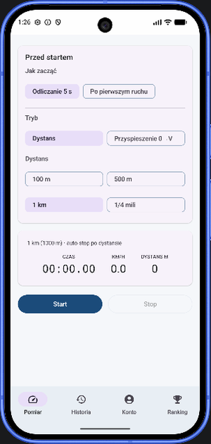
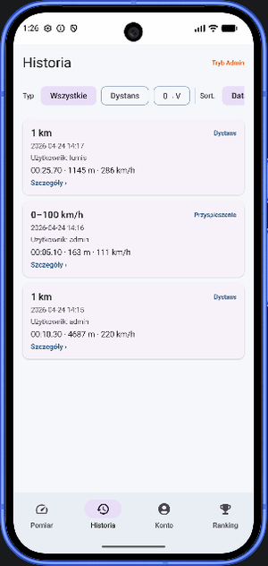
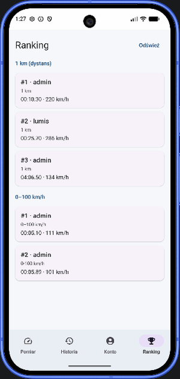
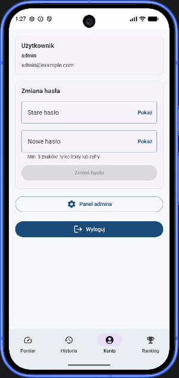

# 🏁 Draggy — GPS-owy pomiar przyspieszenia i czasu przejazdu (Android)

> Natywna aplikacja Android w **Kotlinie i Jetpack Compose**, która zamienia telefon w „drag-meter”: mierzy czas 0–100 km/h, czas na 100 m, 500 m, 1 km lub ¼ mili, zapisuje profil prędkości, działa offline (Room) i synchronizuje wyniki z własnym backendem (**Node.js + MySQL w Dockerze**) do globalnego rankingu.


<p align="center">
  
  
  
  
</p>

## Dlaczego powstał ten projekt

Projekt końcowy z przedmiotu **PAM** (aplikacje mobilne, Uniwersytet Śląski, Informatyka, III rok). Wymaganiem było wykorzystanie co najmniej jednej cechy urządzenia mobilnego. Wybrałem **GPS (Location Services)**, bo pomiar osiągów samochodu to realny problem, który zwykle rozwiązuje się drogimi zewnętrznymi urządzeniami typu *Dragy*. Chciałem sprawdzić, jak daleko da się zajść samym telefonem.

Projekt urósł z „sekundomierza na odległość” do pełnej aplikacji client–server, bo każdy kolejny krok rodził nowe wymaganie: wyniki trzeba gdzieś zapisać (Room), trzeba je porównać z innymi (backend + ranking), a ranking potrzebuje kont i moderacji (JWT + panel admina). Postęp prac jest widoczny w historii commitów.

## Funkcje

**Pomiar**
- dwa tryby: **dystans** (100 m, 500 m, 1 km, ¼ mili) i **przyspieszenie** 0 → 50/75/100/120 km/h, z automatycznym zatrzymaniem po osiągnięciu celu,
- dwie strategie startu: **odliczanie 5 s** albo **uzbrojenie i start przy pierwszym ruchu** (próg przemieszczenia 4 m i prędkości ~3 km/h odfiltrowuje dryf GPS i fałszywe starty),
- **estymacja prędkości**: fuzja prędkości z GPS (`Location.speed`) z prędkością liczoną z dystansu/Δt między fixami (ważenie 55/45, przy słabej dokładności sygnału ufamy tylko estymacji),
- zapis **profilu prędkości** w czasie (ograniczona gęstość próbek) i wykres prędkość–czas w szczegółach próby.

**Dane i społeczność**
- **historia prób** w lokalnej bazie Room z filtrowaniem po typie i sortowaniem, działa bez internetu,
- **synchronizacja w tle** przez WorkManager (`CoroutineWorker` z warunkiem dostępnej sieci) i REST API; idempotentny upload dzięki UUID nadawanemu na urządzeniu (`client_record_id`),
- **globalny ranking** najlepszych czasów dla każdego trybu,
- **konta użytkowników**: rejestracja, logowanie, zmiana hasła, sesja z tokenem JWT,
- **panel administratora**: lista użytkowników, usuwanie kont i podejrzanych prób z rankingu.

## Architektura

```
┌──────────────── Android (Kotlin, Compose) ────────────────┐
│  ui/        ekrany Compose (measure, history, leaderboard, │
│             account, auth, admin) + motyw Material 3       │
│  gps/       GpsSpeedEstimator – fuzja prędkości GPS        │
│  data/      Room: encje, DAO (Flow), kodek profilu prędk.  │
│  sync/      WorkManager + Retrofit – kolejka do wysłania   │
│  auth/      AuthRepository, SessionManager (JWT)           │
│  leaderboard/, admin/   repozytoria + API Retrofit         │
└──────────────────────────────┬─────────────────────────────┘
                               │ REST / JSON (JWT Bearer)
┌──────────────────────────────▼─────────────────────────────┐
│  database/api   Node.js + Express: auth, ranking, admin,   │
│                 przyjmowanie prób (bcrypt, jsonwebtoken)    │
│  database/mysql MySQL 8: schemat, seed, migracja            │
│  phpMyAdmin     podgląd bazy w trakcie developmentu         │
└────────────────────────────────────────────────────────────┘
```

Aplikacja jest **offline-first**: każda próba najpierw trafia do Room ze stanem `SyncState.PENDING`, a worker wysyła zaległe rekordy, gdy pojawi się sieć. UI obserwuje bazę przez `Flow`, więc ekran historii odświeża się sam.

### Endpointy API

| Metoda | Ścieżka | Opis |
|---|---|---|
| `GET` | `/health` | healthcheck |
| `POST` | `/api/auth/register`, `/api/auth/login` | rejestracja / logowanie → JWT |
| `GET` | `/api/auth/me` | profil zalogowanego użytkownika |
| `PUT` | `/api/auth/change-password` | zmiana hasła |
| `GET` | `/api/leaderboard` | najlepsze wyniki dla każdego trybu |
| `POST` | `/api/attempts` | upload próby (idempotentny po `client_record_id`) |
| `GET` / `DELETE` | `/api/admin/users[/:id]` | zarządzanie użytkownikami (rola `admin`) |
| `DELETE` | `/api/admin/attempts/:id` | usunięcie próby z rankingu (rola `admin`) |

## Uruchomienie

### 1. Backend (Docker Desktop)

```bash
cd database
docker compose up -d --build
```

| Usługa | Adres |
|---|---|
| API | http://localhost:8090/health |
| phpMyAdmin | http://localhost:8080 |
| MySQL | `localhost:3306`, baza `pam` |

Dane uwierzytelniające w `docker-compose.yml` są wyłącznie deweloperskie.

### 2. Aplikacja

1. Otwórz projekt w **Android Studio** (AGP 9, JDK 17+).
2. Na emulatorze API jest dostępne pod `http://10.0.2.2:8090/` (domyślnie). Na fizycznym telefonie zmień `SYNC_BASE_URL` w `app/build.gradle.kts` na IP komputera w sieci LAN.
3. Uruchom na urządzeniu z Androidem 14+ (minSdk 34) i zezwól na dostęp do lokalizacji.

> Pomiary wykonuj wyłącznie na zamkniętym torze lub w miejscu, gdzie jest to legalne i bezpieczne.

## Stack

| Warstwa | Technologie |
|---|---|
| UI | Jetpack Compose, Material 3, Navigation Bar, SplashScreen API |
| Lokalizacja | Google Play Services Location (FusedLocationProvider) |
| Dane lokalne | Room (KSP), Kotlin Coroutines, Flow |
| Sieć | Retrofit 2, OkHttp, Gson |
| Tło | WorkManager |
| Backend | Node.js, Express, mysql2, bcryptjs, jsonwebtoken |
| Baza | MySQL 8 (InnoDB, utf8mb4), widok do czytelnego podglądu prób |
| Infra | Docker Compose (MySQL + API + phpMyAdmin) |

## Struktura repozytorium

```
├── app/src/main/java/pl/pam/startproject/
│   ├── ui/            # ekrany Compose + motyw
│   ├── gps/           # estymacja prędkości
│   ├── data/          # Room: encje, DAO, baza
│   ├── sync/          # WorkManager + API synchronizacji
│   ├── auth/          # logowanie, sesja, mapowanie błędów
│   ├── leaderboard/   # ranking
│   └── admin/         # panel administratora
├── database/
│   ├── api/           # backend Node.js (Dockerfile, server.js)
│   ├── mysql/         # schemat, seed, migracja, eksport
│   └── docker-compose.yml
└── docs/screenshots/
```

## Ograniczenia i plan rozwoju

- [ ] usunięcie kolumny `password_plain` i trzymanie wyłącznie hashy bcrypt,
- [ ] refresh tokeny zamiast długiego JWT (30 dni) i przechowywanie tokenu w EncryptedSharedPreferences,
- [ ] testy jednostkowe `GpsSpeedEstimator` i logiki presetów, testy UI Compose,
- [ ] eksport próby do CSV/GPX, porównanie dwóch przejazdów na jednym wykresie,
- [ ] obsługa zewnętrznego odbiornika GNSS 10 Hz przez Bluetooth dla większej precyzji.

## Autor

**Maksym Litosh** — Uniwersytet Śląski w Katowicach.
